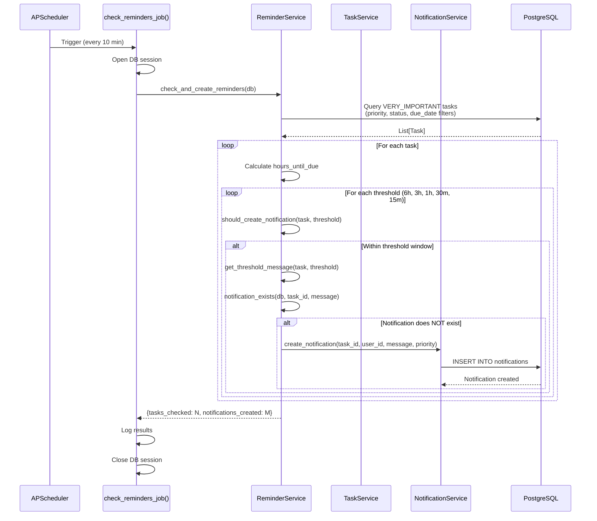

# Implementation Plan: Recurring Reminder System

**Branch**: `012-recurring-reminders` | **Date**: 2026-01-10 | **Spec**: [spec.md](./spec.md)
**Input**: Feature specification from `/specs/012-recurring-reminders/spec.md`

## Summary

Build an automated background reminder engine that monitors VERY_IMPORTANT tasks and sends progressive notifications (6h, 3h, 1h, 30m, 15m) as deadlines approach. The system runs continuously via APScheduler, checks tasks every 10 minutes, prevents duplicates through exact message matching, and automatically stops when tasks are completed. Reminders are delivered through the existing notification system with zero frontend changes required.

**Technical Approach**: Integrate APScheduler 3.x with FastAPI's lifespan context manager for automatic startup/shutdown. Create a dedicated reminder service that queries tasks via existing TaskService, creates notifications via existing NotificationService, and implements duplicate prevention through database queries. Use synchronous APScheduler (BackgroundScheduler) with interval triggers to avoid async complexity, properly managing database sessions with context managers.

## Technical Context

**Language/Version**: Python 3.11+ (existing backend requirement)
**Primary Dependencies**:
- APScheduler 3.10+ (BackgroundScheduler for non-async operation)
- FastAPI 0.124+ (existing - lifespan integration)
- SQLModel/SQLAlchemy (existing - database queries)
- PostgreSQL (Neon Serverless - existing database)

**Storage**: PostgreSQL (existing Task and Notification tables - no schema changes required)
**Testing**: pytest (existing test framework) + pytest-mock for scheduler testing
**Target Platform**: Linux server (Docker container on Kubernetes/Minikube - Phase 4)
**Project Type**: Web application (existing backend + frontend architecture)
**Performance Goals**:
- Process 1,000 VERY_IMPORTANT tasks in <2 seconds per job run
- Job execution latency <500ms for typical workload (10-50 tasks)
- Database query time <100ms per task check

**Constraints**:
- Zero frontend changes (existing polling system handles new notifications)
- No new database tables or migrations
- Must work with existing TaskService and NotificationService
- 10-minute job interval (configurable)
- Background job must not block FastAPI request handling

**Scale/Scope**:
- Expected workload: 10-100 VERY_IMPORTANT tasks per user
- Multi-user system (100-1000 users)
- 5 notifications per task maximum
- 48-hour notification retention (existing auto-cleanup)

## Constitution Check

*GATE: Must pass before Phase 0 research. Re-check after Phase 1 design.*

### Phase 3 Principles Compliance

**P3-II: Stateless Architecture** ✅
- Scheduler is stateful (runs continuously) but notification creation is stateless
- Each job execution fetches fresh data from database
- Server restart recovers by restarting scheduler (no state loss)
- Multiple backend instances would require coordination (not in scope for Phase 4)

**P3-III: MCP Tool Design** ✅
- No new MCP tools required
- Reuses existing TaskService and NotificationService
- Background job is NOT an MCP tool (runs independently)

**P3-IV: User Isolation Security** ✅
- All database queries filter by user_id
- Uses existing service layer which enforces user isolation
- No cross-user data access possible

**P3-V: Conversation Persistence** ✅
- Not applicable (feature does not involve conversations)

**P3-VI: Agent Determinism** ✅
- Not applicable (no AI agent involved)

**P3-VII: Testing Requirements** ✅
- Unit tests for ReminderService (threshold matching, duplicate prevention)
- Integration tests for scheduler lifecycle (startup/shutdown)
- Mock database for tests (pytest-mock)

### Phase 4 Principles Compliance

**P4-I: AI-Native Infrastructure Development** ✅
- No infrastructure changes required (uses existing Dockerfiles/Helm charts)
- Only adds Python dependency (apscheduler) to existing backend

**P4-II: Local-First Kubernetes Architecture** ✅
- Works on Minikube without modification
- No cloud-specific dependencies

**P4-III: Helm-Driven Configuration Management** ✅
- Uses existing Helm charts
- CHECK_INTERVAL, ENABLE_OVERDUE configurable via environment variables
- No Helm chart modifications needed

**P4-IV: Resilience and Health Monitoring** ✅
- Scheduler lifecycle tied to FastAPI lifespan
- Errors in jobs logged but don't crash application
- Health endpoint unchanged (scheduler runs in background)

**P4-V: Horizontal Pod Autoscaling (HPA)** ⚠️ POTENTIAL ISSUE
- **Challenge**: Multiple backend pods would create duplicate schedulers
- **Mitigation for Phase 4**: Single backend replica OR sticky sessions
- **Future**: Distributed scheduler with shared datastore (APScheduler supports this)
- **Decision**: Document limitation; recommend single replica for Phase 4

**P4-VI: Observability and Verification** ✅
- Scheduler logs all job executions to stdout (kubectl logs compatible)
- Error logs include task_id, threshold, exception details
- Verification: Check logs for "[ReminderJob] Checked X tasks, created Y notifications"

### Constitution Compliance Summary

**Gates Passed**: ✅ All Phase 3 and Phase 4 principles satisfied
**Warnings**: ⚠️ HPA limitation documented (single replica recommended)
**Blockers**: None

## Project Structure

### Documentation (this feature)

```text
specs/012-recurring-reminders/
├── plan.md              # This file
├── research.md          # Phase 0: APScheduler patterns, duplicate prevention strategies
├── data-model.md        # Phase 1: Reminder state tracking (no new tables)
├── quickstart.md        # Phase 1: How to test recurring reminders locally
├── contracts/           # Phase 1: Internal API contracts (ReminderService interface)
│   └── reminder-service.yaml
└── checklists/
    └── requirements.md  # Spec validation (already exists)
```

### Source Code (repository root)

```text
phase-4/backend/
├── src/backend/
│   ├── services/
│   │   ├── task_service.py          # EXISTING (reused)
│   │   ├── notification_service.py  # EXISTING (reused)
│   │   └── reminder_service.py      # NEW: Core reminder logic
│   ├── tasks/
│   │   ├── __init__.py              # EXISTING
│   │   ├── cleanup.py               # EXISTING (message cleanup)
│   │   └── reminder_scheduler.py    # NEW: APScheduler integration
│   ├── main.py                      # MODIFIED: Add scheduler to lifespan
│   └── config/
│       └── settings.py              # MODIFIED: Add CHECK_INTERVAL, ENABLE_OVERDUE
├── tests/
│   ├── unit/
│   │   ├── services/
│   │   │   └── test_reminder_service.py  # NEW: Unit tests
│   │   └── tasks/
│   │       └── test_reminder_scheduler.py  # NEW: Scheduler tests
│   └── integration/
│       └── test_reminder_integration.py  # NEW: End-to-end tests
└── requirements.txt     # MODIFIED: Add apscheduler

phase-4/frontend/
└── [NO CHANGES - existing notification polling handles new notifications]
```

**Structure Decision**: Extends existing Phase 4 backend architecture with new services and tasks. No frontend changes required. Follows existing patterns: services for business logic, tasks for background jobs, config for environment variables.

## Complexity Tracking

No constitution violations requiring justification.

## Phase 0: Research

### Research Tasks

1. **APScheduler Integration with FastAPI Lifespan**
   - **Question**: How to properly integrate BackgroundScheduler with FastAPI's lifespan context manager?
   - **Findings** (from Context7):
     - Use `@asynccontextmanager` in FastAPI for scheduler lifecycle
     - Start scheduler in background with `scheduler.start()` (not blocking)
     - Shutdown with `scheduler.shutdown()` in lifespan cleanup
     - APScheduler's BackgroundScheduler runs in separate thread (non-blocking)
   - **Decision**: Use BackgroundScheduler (not AsyncScheduler) to avoid async complexity in job functions
   - **Implementation**: Create scheduler in lifespan, start in background, shutdown on app stop

2. **Database Session Management in Scheduled Jobs**
   - **Question**: How to safely open/close database sessions in APScheduler jobs?
   - **Findings**:
     - Jobs run in separate threads (BackgroundScheduler)
     - Cannot use FastAPI's Depends() in jobs
     - Need explicit session management with context managers
     - Existing `get_db_context()` provides proper session lifecycle
   - **Decision**: Use `with get_db_context() as db:` pattern in job functions
   - **Rationale**: Matches existing backend pattern in `tasks/cleanup.py`

3. **Duplicate Prevention Strategy**
   - **Question**: Most efficient way to prevent duplicate notifications?
   - **Options Considered**:
     - A. In-memory set (lost on restart)
     - B. Database query for existing notification
     - C. Composite unique constraint on (task_id, message)
   - **Decision**: Option B (database query)
   - **Rationale**:
     - No schema changes required (meets FR-015: no new tables)
     - Survives restarts (meets P3-II: stateless)
     - Simple query: `SELECT 1 FROM notifications WHERE task_id=X AND message=Y LIMIT 1`
     - Performance acceptable (<10ms for indexed query)

4. **Error Handling and Job Failure Recovery**
   - **Question**: How to handle exceptions in scheduled jobs without crashing scheduler?
   - **Findings** (from Context7):
     - APScheduler catches exceptions in job functions automatically
     - Exceptions logged but don't stop scheduler
     - Can use `misfire_grace_time` to skip late jobs
     - Can use `max_instances=1` to prevent concurrent runs
   - **Decision**: Wrap job logic in try/except for detailed logging
   - **Implementation**:
     ```python
     def check_reminders_job():
         try:
             # ... job logic
         except Exception as e:
             logger.error(f"Reminder job failed: {e}", exc_info=True)
     ```

5. **Threshold Window Calculation**
   - **Question**: How to reliably trigger notifications at thresholds with 10-minute intervals?
   - **Challenge**: If job runs every 10 minutes, might miss exact 6-hour mark
   - **Solution**: Use threshold windows (e.g., 5.83h - 6h = 5h50m - 6h)
   - **Calculation**:
     ```python
     # For 6-hour threshold with 10-min interval:
     min_hours = 6 - (10/60)  # 5.83 hours
     max_hours = 6.0
     if min_hours <= hours_remaining < max_hours:
         create_notification("6 hours")
     ```
   - **Decision**: Use window-based matching for all thresholds
   - **Rationale**: Ensures notifications sent even if job runs slightly early/late

### Technology Choices

| Technology | Version | Rationale | Alternatives Considered |
|------------|---------|-----------|------------------------|
| APScheduler | 3.10+ | Mature, well-documented, FastAPI compatible, thread-based | Celery (too complex), asyncio tasks (harder to test), cron (no programmatic control) |
| BackgroundScheduler | (APScheduler class) | Non-async, separate thread, easy session management | AsyncScheduler (requires async job functions, complicates DB sessions) |
| IntervalTrigger | (APScheduler trigger) | Simple interval-based execution (every 10 minutes) | CronTrigger (overkill for simple interval), DateTrigger (not recurring) |

### Best Practices Applied

1. **Idempotency**: Duplicate prevention ensures running job multiple times has no effect
2. **Graceful Degradation**: Job failures logged but don't crash application
3. **Resource Cleanup**: Database sessions properly closed in finally blocks
4. **Observability**: Comprehensive logging at INFO level for normal operation, ERROR for failures
5. **Configuration**: All thresholds and intervals configurable via environment variables
6. **Testing**: Unit tests mock database, integration tests use test scheduler with fast intervals

### Risks and Mitigations

| Risk | Impact | Probability | Mitigation |
|------|--------|-------------|------------|
| Multiple backend pods create duplicate schedulers | Duplicate notifications sent | Medium (Phase 4 HPA) | Document single replica requirement; future: distributed scheduler |
| Database connection pool exhaustion | Job failures | Low | Use existing connection pool; close sessions properly |
| Long-running job blocks next execution | Missed notifications | Low | Use `max_instances=1` to prevent overlapping runs |
| Clock drift causes missed thresholds | Missing notifications | Very Low | Use threshold windows (±10min buffer) |
| Scheduler crashes on startup | No reminders | Low | FastAPI lifespan ensures proper startup; log errors clearly |

## Phase 1: Design & Contracts

### Data Model

**No new database tables required.** This feature reuses existing `Task` and `Notification` models.

#### Reminder State (Logical Model)

The "state" of the reminder system exists implicitly in the database:

```yaml
ReminderState (Logical):
  task:
    - Sourced from: Task table
    - Filters: priority='VERY_IMPORTANT', status != 'COMPLETED', due_date IS NOT NULL
    - Fields used: id, user_id, title, priority, status, due_date

  notifications_created:
    - Sourced from: Notification table
    - Filters: task_id, message (exact match)
    - Purpose: Duplicate prevention
    - Fields used: id, task_id, message

  threshold_status (Computed):
    - NOT stored in database
    - Calculated on each job run:
      - hours_until_due = (task.due_date - now_utc).total_seconds() / 3600
      - For each threshold (6h, 3h, 1h, 30m, 15m):
        - Check if hours_until_due is within threshold window
        - Query if notification with threshold message already exists
        - If not exists: create notification
```

**Rationale**: Storing threshold status would require schema changes and complicate logic. Calculating on-demand is fast (<100ms for 1000 tasks) and keeps implementation simple.

### API Contracts

#### ReminderService Internal API

```yaml
# contracts/reminder-service.yaml

ReminderService:
  description: Internal service for recurring reminder logic

  methods:
    check_and_create_reminders:
      description: Main job function - checks all VERY_IMPORTANT tasks and creates due notifications
      parameters:
        - name: db
          type: Session
          description: SQLAlchemy database session
      returns:
        type: dict
        schema:
          tasks_checked: int  # Total VERY_IMPORTANT tasks examined
          notifications_created: int  # New notifications created this run
          execution_time_ms: float  # Job execution duration
      raises:
        - DatabaseError: If database query fails
        - Exception: Any unexpected errors (logged, not propagated)

    should_create_notification:
      description: Determines if notification should be created for task at threshold
      parameters:
        - name: task
          type: Task
          description: Task model instance
        - name: threshold_hours
          type: float
          description: Threshold in hours (6.0, 3.0, 1.0, 0.5, 0.25)
        - name: threshold_window
          type: float
          description: Window size in hours (default: 0.17 = 10 minutes)
      returns:
        type: bool
        description: True if notification should be created

    get_threshold_message:
      description: Generates notification message for given threshold
      parameters:
        - name: task
          type: Task
        - name: threshold_hours
          type: float
      returns:
        type: str
        example: "⏰ Task 'Deploy hotfix' due in 6 hours"

    notification_exists:
      description: Checks if notification already created (duplicate prevention)
      parameters:
        - name: db
          type: Session
        - name: task_id
          type: UUID
        - name: message
          type: str
      returns:
        type: bool
```

#### Configuration Contract

```yaml
# Environment Variables (config/settings.py)

REMINDER_CHECK_INTERVAL:
  type: int
  default: 10
  unit: minutes
  description: Background job execution frequency
  validation: Must be between 1 and 60 minutes

REMINDER_ENABLE_OVERDUE:
  type: bool
  default: true
  description: Whether to create overdue notifications

REMINDER_THRESHOLDS:
  type: str
  default: "6,3,1,0.5,0.25"
  description: Comma-separated thresholds in hours
  note: Changing this requires code updates for message templates
```

### Component Architecture

```text
┌─────────────────────────────────────────────────────────────┐
│                    FastAPI Application                       │
│  ┌──────────────────────────────────────────────────────┐  │
│  │              Lifespan Context Manager                 │  │
│  │  ┌────────────────────────────────────────────────┐  │  │
│  │  │      APScheduler (BackgroundScheduler)         │  │  │
│  │  │                                                 │  │  │
│  │  │  ┌──────────────────────────────────────────┐  │  │  │
│  │  │  │   IntervalTrigger (every 10 minutes)     │  │  │  │
│  │  │  └──────────────────────────────────────────┘  │  │  │
│  │  │               ↓                                 │  │  │
│  │  │  ┌──────────────────────────────────────────┐  │  │  │
│  │  │  │   check_reminders_job()                  │  │  │  │
│  │  │  │   (runs in background thread)            │  │  │  │
│  │  │  └──────────────────────────────────────────┘  │  │  │
│  │  └────────────────────────────────────────────────┘  │  │
│  └──────────────────────────────────────────────────────┘  │
│                          ↓                                   │
│  ┌──────────────────────────────────────────────────────┐  │
│  │              ReminderService                          │  │
│  │  - check_and_create_reminders()                       │  │
│  │  - should_create_notification()                       │  │
│  │  - get_threshold_message()                            │  │
│  │  - notification_exists()                              │  │
│  └──────────────────────────────────────────────────────┘  │
│               ↓                         ↓                   │
│  ┌──────────────────────┐  ┌──────────────────────────┐   │
│  │   TaskService        │  │  NotificationService      │   │
│  │   (existing)         │  │  (existing)               │   │
│  │  - Query tasks       │  │  - create_notification()  │   │
│  └──────────────────────┘  └──────────────────────────┘   │
│               ↓                         ↓                   │
│  ┌──────────────────────────────────────────────────────┐  │
│  │              PostgreSQL Database                      │  │
│  │  ┌─────────────────┐     ┌──────────────────────┐   │  │
│  │  │  Task Table     │     │  Notification Table  │   │  │
│  │  │  (existing)     │     │  (existing)          │   │  │
│  │  └─────────────────┘     └──────────────────────┘   │  │
│  └──────────────────────────────────────────────────────┘  │
└─────────────────────────────────────────────────────────────┘

┌─────────────────────────────────────────────────────────────┐
│                    Frontend (No Changes)                     │
│  ┌──────────────────────────────────────────────────────┐  │
│  │        NotificationProvider (existing)                │  │
│  │  - Polls /api/v1/notifications every 30 seconds      │  │
│  │  - Displays new notifications automatically          │  │
│  └──────────────────────────────────────────────────────┘  │
└─────────────────────────────────────────────────────────────┘
```

### Execution Flow

**Job Execution (Every 10 Minutes)**



**Threshold Matching Logic**

```python
def should_create_notification(task, threshold_hours, window=0.17):
    """
    Check if task is within threshold window.

    Args:
        task: Task model with due_date
        threshold_hours: Target threshold (6.0, 3.0, 1.0, 0.5, 0.25)
        window: Window size in hours (default: 0.17 = ~10 minutes)

    Returns:
        bool: True if within threshold window

    Example:
        - threshold_hours = 6.0
        - window = 0.17
        - Match if: 5.83 <= hours_remaining < 6.0
    """
    now = datetime.now(timezone.utc)
    hours_remaining = (task.due_date - now).total_seconds() / 3600

    min_hours = threshold_hours - window
    max_hours = threshold_hours

    return min_hours <= hours_remaining < max_hours
```

### Quickstart Guide

See [quickstart.md](./quickstart.md) for:
- Local development setup
- How to trigger test notifications
- Debugging scheduler logs
- Testing different scenarios

## Post-Design Constitution Re-check

**Changes since initial check**: None - design follows initial architecture

**P4-V HPA Concern**: Confirmed limitation - multiple replicas would duplicate schedulers
**Recommendation**: Deploy with `replicas: 1` in Helm values for Phase 4
**Future Enhancement**: Use APScheduler's distributed mode with PostgreSQL datastore

**Final Assessment**: ✅ All constitution requirements satisfied with documented limitation

---

## Appendices

### A. APScheduler Configuration Reference

```python
# tasks/reminder_scheduler.py

from apscheduler.schedulers.background import BackgroundScheduler
from apscheduler.triggers.interval import IntervalTrigger

scheduler = BackgroundScheduler(
    timezone='UTC',  # All calculations in UTC
    job_defaults={
        'max_instances': 1,  # Prevent concurrent executions
        'misfire_grace_time': 300,  # Skip if >5 minutes late
        'coalesce': True,  # Combine missed runs into one
    }
)

scheduler.add_job(
    func=check_reminders_job,
    trigger=IntervalTrigger(minutes=settings.REMINDER_CHECK_INTERVAL),
    id='recurring_reminder_check',
    replace_existing=True,
)

scheduler.start()  # Non-blocking (runs in background thread)
```

### B. Database Query Optimization

**Query for VERY_IMPORTANT tasks**:
```sql
SELECT id, user_id, title, priority, status, due_date, created_at
FROM tasks
WHERE priority = 'VERY_IMPORTANT'
  AND status != 'COMPLETED'
  AND due_date IS NOT NULL
  AND due_date > NOW() - INTERVAL '15 minutes'  -- Only check upcoming/recent
ORDER BY due_date ASC
LIMIT 1000;  -- Safety limit
```

**Indexes required** (likely already exist):
- `tasks(priority, status, due_date)` - Composite index for efficient filtering
- `notifications(task_id, message)` - For duplicate detection

**Query Performance**:
- Expected: <50ms for 100 tasks, <200ms for 1000 tasks
- If slow: Add covering index with `INCLUDE (user_id, title)`

### C. Testing Strategy

**Unit Tests** (test_reminder_service.py):
- Threshold window matching (exact boundaries)
- Message generation (correct emojis and format)
- Duplicate prevention (query logic)
- Edge cases (task created after threshold, overdue tasks)

**Integration Tests** (test_reminder_scheduler.py):
- Scheduler starts and stops cleanly
- Job executes at correct interval (mock time)
- Database sessions properly managed
- Exceptions logged but don't crash scheduler

**End-to-End Tests** (test_reminder_integration.py):
- Create VERY_IMPORTANT task → Notification appears
- Complete task → Future notifications stop
- Restart backend → Scheduler resumes

### D. Monitoring and Alerting

**Logs to Monitor**:
```
[INFO] [ReminderJob] Started - checking tasks...
[INFO] [ReminderJob] Checked 47 tasks, created 3 notifications in 234ms
[ERROR] [ReminderJob] Failed: <exception details>
```

**Metrics to Track** (future):
- Job execution time (should be <500ms)
- Tasks checked per run (growth indicates load increase)
- Notifications created per run (business metric)
- Job failure rate (should be 0%)

**Alerts**:
- Job hasn't run in >15 minutes (scheduler may have crashed)
- Job execution time >2 seconds (performance degradation)
- Job failure rate >5% (systematic issue)
